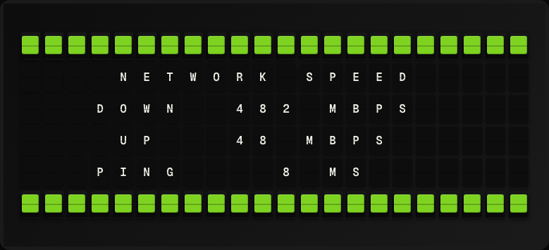

# Network Speed Plugin

Display your internet connection speed using a local Speedtest CLI check.



**→ [Setup Guide](./docs/SETUP.md)**

## Overview

The Network Speed plugin runs a Speedtest CLI speed test on the FiestaBoard host and displays the measured download speed, upload speed, and ping. Tests run in the background on a configurable interval. Requires the `speedtest-cli` Python package.

## Template Variables

| Variable | Description | Example |
|---|---|---|
| `network_speed.download_mbps` | Download speed in Mbps | `250.4` |
| `network_speed.upload_mbps` | Upload speed in Mbps | `18.7` |
| `network_speed.ping_ms` | Latency in milliseconds | `14.3` |
| `network_speed.last_tested` | Timestamp of the last speed test | `2026-05-01 12:00` |

## Example Templates

```
NETWORK SPEED
Down: {{network_speed.download_mbps}} Mbps
Up:   {{network_speed.upload_mbps}} Mbps
Ping: {{network_speed.ping_ms}} ms

{{network_speed.last_tested}}
```

## Configuration

| Setting | Name | Description | Required |
|---|---|---|---|
| `refresh_seconds` | Refresh Interval | How often to fetch data (seconds) | No |

## Features

- Speedtest CLI integration
- Download, upload, and ping
- Background test execution
- No external API key

## Author

FiestaBoard Team
