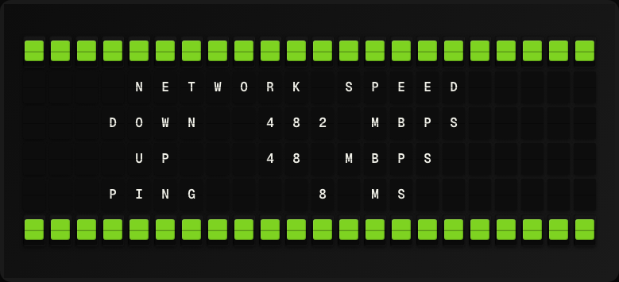

# Network Speed Plugin

Display your internet connection speed, measured against Cloudflare's speed-test endpoints.



**→ [Setup Guide](./docs/SETUP.md)**

## Overview

The Network Speed plugin measures download speed, upload speed, and latency from the FiestaBoard host by transferring data against `speed.cloudflare.com`, and displays the result on your board.

The measurement runs on a background thread. A speed test takes seconds, and FiestaBoard gives every plugin 15 seconds to produce data for a render — so the test cannot run on the render path. Instead the plugin always reports the last completed measurement, and starts the next one when the interval is up. Your board never waits for a speed test, and it keeps showing the previous numbers (with their timestamp) while a new one runs.

No API key is required, and no third-party packages are needed — only `requests`, which FiestaBoard already ships.

## Template Variables

| Variable | Description | Example |
|---|---|---|
| `network_speed.download_mbps` | Download speed in Mbps | `250.4` |
| `network_speed.upload_mbps` | Upload speed in Mbps | `18.7` |
| `network_speed.ping_ms` | HTTP round-trip latency in milliseconds | `14.3` |
| `network_speed.last_tested` | When the displayed measurement was taken | `2026-05-01 12:00` |

Until the first test finishes — usually a few seconds after you enable the plugin — the variables are unavailable and the Integrations page shows "Speed test in progress".

## Example Templates

```
NETWORK SPEED
Down: {{network_speed.download_mbps}} Mbps
Up:   {{network_speed.upload_mbps}} Mbps
Ping: {{network_speed.ping_ms}} ms

{{network_speed.last_tested}}
```

## Configuration

| Setting | Name | Description | Required |
|---|---|---|---|
| `refresh_seconds` | Test Interval | How often to run a speed test. Default 21600 (6 hours), minimum 1800 | No |
| `max_transfer_mb` | Max Transfer Size (MB) | Largest transfer per direction. Default 25, range 5–100 | No |

### How much data a test uses

Each test transfers at most `max_transfer_mb` in each direction, so at the defaults a test costs up to 50 MB and runs four times a day — roughly 200 MB per day in the worst case. A slower connection uses far less, because each direction stops after about 2.5 seconds regardless of how little has moved.

Raise `max_transfer_mb` if you have a fast link and want a more accurate number; lower it on a metered connection.

## Features

- Download, upload, and latency
- Measured off the render path, so the board never stalls on a test
- Previous result stays on the board while the next test runs
- Bandwidth bounded by an explicit per-test cap
- No API key
- No dependencies beyond what FiestaBoard ships

## Author

FiestaBoard Team
